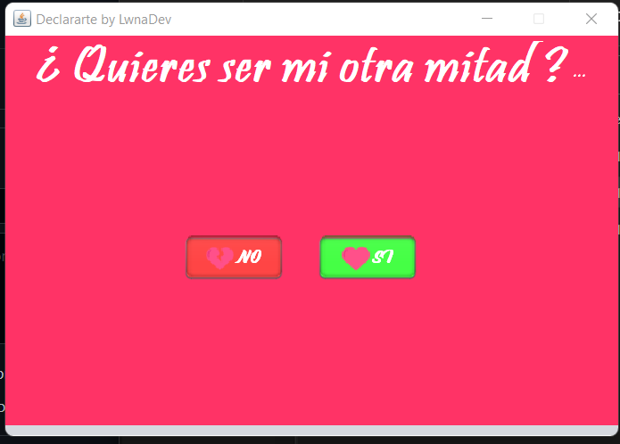

<h1 align="center">🥰 Declararse Java 🥰</h1>

  Small Java application that allows you to declare your feelings... Using NetBeans

### App
  

> This project was made for learning and funny purposes only, Any errors that may be found must be corrected by yourself.

# How to use
## Step 1⃣
* Import the project to your netbeans folder
## Step 2
* Open the project, check for errors and then compile and run.
## Step 3
* Thats all!

# Download
Only Available Jar file.

[Jar](https://github.com/alexa-00/grados/raw/main/releases/Declararse.jar)

# License
💜 [MIT License](/LICENSE)
